### 相关文件
1. lua.h 类型定义, 外部api声明
```cpp
#define LUA_TTABLE		5
#define lua_newtable(L)		lua_createtable(L, 0, 0)
// stack index func
#define lua_istable(L,n)	(lua_type(L, (n)) == LUA_TTABLE) 
```

2. lobject.h 结构定义和内部api
```cpp
// StkId(TValue*) func
#define ttistable(o)		checktag((o), ctb(LUA_TTABLE)) // is func
#define hvalue(o)	check_exp(ttistable(o), gco2t(val_(o).gc)) // get func
#define sethvalue(L,obj,x) \ // set func
  { TValue *io = (obj); Table *x_ = (x); \
    val_(io).gc = obj2gco(x_); settt_(io, ctb(LUA_TTABLE)); \
    checkliveness(G(L),io); }
// data struct
struct TKey {};
struct Node {};
struct Table {};
```

3. ltable.h, ltable.c 核心实现
```cpp
LUAI_FUNC const TValue *luaH_getint (Table *t, lua_Integer key);
LUAI_FUNC void luaH_setint (lua_State *L, Table *t, lua_Integer key,
                                                    TValue *value);
LUAI_FUNC const TValue *luaH_getstr (Table *t, TString *key);
LUAI_FUNC const TValue *luaH_get (Table *t, const TValue *key);
LUAI_FUNC TValue *luaH_newkey (lua_State *L, Table *t, const TValue *key);
LUAI_FUNC TValue *luaH_set (lua_State *L, Table *t, const TValue *key);
LUAI_FUNC Table *luaH_new (lua_State *L);
LUAI_FUNC void luaH_resize (lua_State *L, Table *t, unsigned int nasize,
                                                    unsigned int nhsize);
LUAI_FUNC void luaH_resizearray (lua_State *L, Table *t, unsigned int nasize);
LUAI_FUNC void luaH_free (lua_State *L, Table *t);
LUAI_FUNC int luaH_next (lua_State *L, Table *t, StkId key);
LUAI_FUNC int luaH_getn (Table *t);
```

4. ltablib.c 库
```cpp
static const luaL_Reg tab_funcs[] = {
  {"concat", tconcat},
#if defined(LUA_COMPAT_MAXN)
  {"maxn", maxn},
#endif
  {"insert", tinsert},
  {"pack", pack},
  {"unpack", unpack},
  {"remove", tremove},
  {"move", tmove},
  {"sort", sort},
  {NULL, NULL}
};
LUAMOD_API int luaopen_table (lua_State *L) {
  ...
}
```

5. lapi.c api函数实现
```cpp
LUA_API void lua_createtable (lua_State *L, int narray, int nrec) {
  ...
}
```

### 使用
1. new
2. get
3. set
4. is
5. for

### 原理
#### 1. struct
```cpp
// 关键字段
typedef struct Table {
  // array part
  unsigned int sizearray;  /* size of 'array' array */
  TValue *array;  /* array part */
  // hash part
  lu_byte lsizenode;  /* log2 of size of 'node' array */
  Node *node;
  Node *lastfree;  /* any free position is before this position */
  ...
} Table;

typedef struct Node {
  TValue i_val;
  TKey i_key;
} Node;

typedef union TKey {
  struct {
    TValuefields;
    int next;  /* for chaining (offset for next node) */
  } nk;
  TValue tvk;
} TKey;
```



#### 2. flow
1. new
luaH_new

2. get
luaH_getint
luaH_get


3. set
luaH_setint
luaH_set
luaH_newkey
rehash
resize

4. for
luaH_next

#### 3. design

### 问题
1. 不同类型的hash, mainposition
2. metatable
```
luaV_gettable
```
3. 为什么node的size是log2n
```
为了保证nodesize是2n大小，指数增长的，rehash是一个重新分配内存并数据大搬迁的过程，比较耗，指数增长牺牲了内存，但能减少rehash的次数，提高cpu性能
```
4. array的size也是log2n吗
```
不是，虽然rehash会把arraysize设成2n大少，但arraysize是可以随意大小的，没强要求luaH_getint时，key在arraysize内，就会返回array里的，否则去node找
```
5. 为什么pairs是随机的
6. pairs时set nil了，会影响遍历吗
```lua
for k, v in pairs(t) do
  print(">> k, v", k, v)
  t[k] = nil
end
```

### 参考
